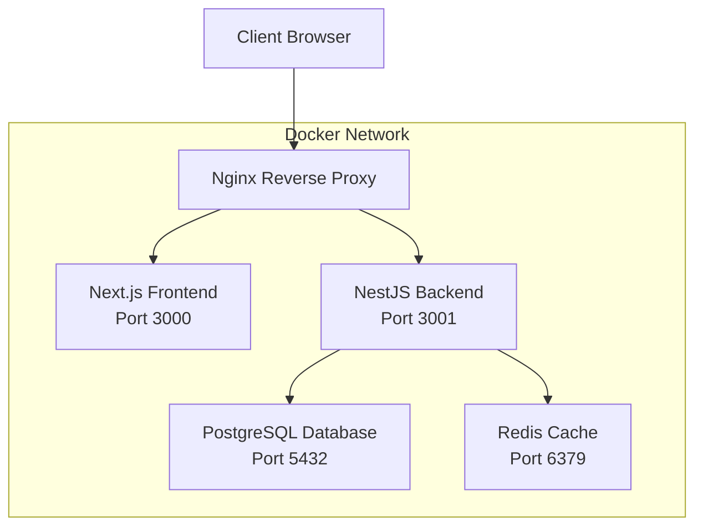

# 📋 Vernon Cyber Security Solutions - Complete Documentation

## Table of Contents

1. [Project Overview](#project-overview)
2. [Architecture](#architecture)
3. [Prerequisites](#prerequisites)
4. [Installation & Setup](#installation--setup)
5. [Configuration](#configuration)
6. [Development](#development)
7. [Deployment](#deployment)
8. [API Documentation](#api-documentation)
9. [Security](#security)
10. [Troubleshooting](#troubleshooting)
11. [Contributing](#contributing)

---

## Project Overview

Vernon Cyber Security Solutions is a modern, professional website designed for a cybersecurity company serving small and medium businesses in Vernon, BC. The platform provides comprehensive cybersecurity services including security assessments, compliance consulting, incident response, and security training.

### Key Features

- **Modern Tech Stack**: Next.js 14, NestJS, PostgreSQL, Redis
- **Responsive Design**: Mobile-first approach with Tailwind CSS
- **Security-First**: JWT authentication, rate limiting, OWASP security headers
- **Client Portal**: Secure dashboard for client interactions
- **Multi-Language Support**: English and French (Canadian)
- **SEO Optimized**: Server-side rendering and meta tag optimization
- **Contact Management**: Advanced contact forms with CRM integration

---

## Architecture



### Service Components

| Service | Technology | Port | Purpose |
|---------|------------|------|---------|
| Frontend | Next.js 14 | 3000 | User interface and client-side logic |
| Backend | NestJS | 3001 | API server and business logic |
| Database | PostgreSQL 15 | 5432 | Data persistence |
| Cache | Redis 7 | 6379 | Session management and caching |
| Proxy | Nginx | 80/443 | Reverse proxy and load balancing |

---

## Prerequisites

Before you begin, ensure you have the following installed:

- **Docker** (v20.10+): [Install Docker](https://docs.docker.com/get-docker/)
- **Docker Compose** (v2.0+): [Install Docker Compose](https://docs.docker.com/compose/install/)
- **Git**: [Install Git](https://git-scm.com/downloads)
- **Node.js** (v18+): [Install Node.js](https://nodejs.org/) (for local development)

### System Requirements

- **RAM**: Minimum 4GB, Recommended 8GB+
- **Storage**: 10GB free space
- **OS**: Linux, macOS, or Windows with WSL2

---

## Installation & Setup

### Quick Start (Recommended)

1. **Clone the repository**:
   ```bash
   git clone https://github.com/your-org/vernon-cybersec.git
   cd vernon-cybersec
   ```

2. **Run the setup script**:
   ```bash
   chmod +x setup.sh
   ./setup.sh
   ```

3. **Access the application**:
   - Frontend: http://localhost:3000
   - Backend API: http://localhost:3001
   - API Documentation: http://localhost:3001/api

### Manual Setup

1. **Environment Configuration**:
   ```bash
   cp .env.example .env
   nano .env  # Edit configuration values
   ```

2. **Build and start services**:
   ```bash
   docker-compose up -d --build
   ```

3. **Run database migrations**:
   ```bash
   docker-compose exec backend npm run db:migrate
   ```

4. **Seed the database**:
   ```bash
   docker-compose exec backend npm run db:seed
   ```

---

## Configuration

### Environment Variables

The application uses environment variables for configuration. Copy `.env.example` to `.env` and update the values:

#### Essential Variables

```bash
# Database
DB_PASSWORD=your_secure_database_password

# Security
JWT_SECRET=your_jwt_secret_minimum_32_characters
SESSION_SECRET=your_session_secret

# Company Information
COMPANY_NAME=Vernon Cyber Security Solutions
COMPANY_EMAIL=info@vernoncybersec.ca
COMPANY_PHONE=+1-250-555-0123

# Email Configuration
SMTP_HOST=smtp.gmail.com
SMTP_USER=your_email@gmail.com
SMTP_PASS=your_app_password
```

#### Optional Integrations

```bash
# Google Analytics
NEXT_PUBLIC_GA_ID=G-XXXXXXXXXX

# reCAPTCHA
NEXT_PUBLIC_RECAPTCHA_SITE_KEY=your_recaptcha_site_key
RECAPTCHA_SECRET_KEY=your_recaptcha_secret_key

# Stripe Payments
STRIPE_PUBLIC_KEY=pk_test_your_stripe_public_key
STRIPE_SECRET_KEY=sk_test_your_stripe_secret_key
```

### Database Schema

The application uses Prisma ORM with PostgreSQL. Key models include:

- **User**: Client accounts and authentication
- **Contact**: Contact form submissions and inquiries
- **Service**: Cybersecurity service offerings
- **SecurityAssessment**: Client security evaluations
- **BlogPost**: Security tips and company news
- **Testimonial**: Client success stories

---

## Development

### Local Development Setup

1. **Install dependencies** (optional for local development):
   ```bash
   cd backend && npm install
   cd ../frontend && npm install
   ```

2. **Start development servers**:
   ```bash
   # Start all services
   docker-compose up -d
   
   # Or start individual services for development
   docker-compose up frontend backend postgres redis
   ```

3. **Database operations**:
   ```bash
   # Create new migration
   docker-compose exec backend npm run db:migrate
   
   # Reset database
   docker-compose exec backend npx prisma migrate reset
   
   # View database
   docker-compose exec backend npx prisma studio
   ```

### Code Structure

```
cybersec-company/
├── backend/                 # NestJS Backend
│   ├── src/
│   │   ├── auth/           # Authentication module
│   │   ├── users/          # User management
│   │   ├── contacts/       # Contact handling
│   │   ├── services/       # Service management
│   │   ├── assessments/    # Security assessments
│   │   ├── blog/           # Blog system
│   │   └── testimonials/   # Testimonials
│   └── prisma/
│       ├── schema.prisma   # Database schema
│       └── migrations/     # Database migrations
├── frontend/               # Next.js Frontend
│   ├── app/                # App router (Next.js 14)
│   ├── components/         # React components
│   │   ├── layout/         # Layout components
│   │   ├── sections/       # Page sections
│   │   ├── forms/          # Form components
│   │   └── ui/             # UI components
│   └── lib/                # Utilities and helpers
└── nginx/                  # Nginx configuration
```

### Available Scripts

#### Backend Scripts
```bash
# In backend directory
npm run start:dev          # Start development server
npm run build              # Build for production
npm run test               # Run tests
npm run db:migrate         # Run database migrations
npm run db:seed            # Seed database
npm run db:reset           # Reset database
```

#### Frontend Scripts
```bash
# In frontend directory
npm run dev                # Start development server
npm run build              # Build for production
npm run start              # Start production server
npm run lint               # Run ESLint
npm run type-check         # TypeScript type checking
```

---

## Deployment

### Production Environment

1. **Server Requirements**:
   - Ubuntu 20.04+ or equivalent Linux distribution
   - 4GB+ RAM, 2+ CPU cores
   - 50GB+ storage
   - Docker and Docker Compose installed

2. **Environment Setup**:
   ```bash
   # Clone repository
   git clone https://github.com/your-org/vernon-cybersec.git
   cd vernon-cybersec
   
   # Copy and configure environment
   cp .env.example .env
   nano .env  # Update for production
   ```

3. **SSL Certificate Setup**:
   ```bash
   # Create SSL directory
   mkdir -p nginx/ssl
   
   # Copy your SSL certificates
   cp your-cert.pem nginx/ssl/cert.pem
   cp your-private-key.key nginx/ssl/private.key
   ```

4. **Deploy**:
   ```bash
   # Build and start services
   docker-compose -f docker-compose.prod.yml up -d --build
   
   # Run database migrations
   docker-compose exec backend npm run db:migrate
   ```

### Production Checklist

- [ ] Environment variables configured for production
- [ ] SSL certificates installed
- [ ] Database backed up
- [ ] Monitoring setup (logs, metrics)
- [ ] Security headers configured
- [ ] Rate limiting enabled
- [ ] Email service configured
- [ ] Domain and DNS configured
- [ ] Firewall rules applied

### Monitoring

Monitor your application using:

```bash
# View logs
docker-compose logs -f

# Monitor resource usage
docker stats

# Check service health
docker-compose ps
```

---

## API Documentation

The API documentation is automatically generated using Swagger/OpenAPI and available at:
- Development: http://localhost:3001/api
- Production: https://api.vernoncybersec.ca/api

### Key Endpoints

#### Authentication
- `POST /auth/login` - User login
- `POST /auth/register` - User registration
- `POST /auth/logout` - User logout
- `GET /auth/profile` - Get user profile

#### Contacts
- `POST /contacts` - Submit contact form
- `GET /contacts` - List contacts (admin)
- `PUT /contacts/:id` - Update contact status

#### Services
- `GET /services` - List all services
- `GET /services/:id` - Get service details
- `POST /services` - Create service (admin)

#### Assessments
- `POST /assessments` - Request security assessment
- `GET /assessments` - List assessments
- `PUT /assessments/:id` - Update assessment

#### Blog
- `GET /blog` - List blog posts
- `GET /blog/:slug` - Get blog post
- `POST /blog` - Create blog post (admin)

---

## Security

### Security Features

1. **Authentication & Authorization**:
   - JWT-based authentication
   - Role-based access control (RBAC)
   - Secure password hashing with bcrypt

2. **API Security**:
   - Rate limiting
   - Input validation and sanitization
   - CORS configuration
   - Request/response logging

3. **Data Protection**:
   - Database encryption at rest
   - Secure data transmission (HTTPS)
   - Sensitive data masking in logs

4. **Infrastructure Security**:
   - Security headers (HSTS, CSP, etc.)
   - Container security scanning
   - Network isolation

### Security Headers

The application implements the following security headers:

```nginx
# Nginx security headers
add_header X-Frame-Options "SAMEORIGIN" always;
add_header X-Content-Type-Options "nosniff" always;
add_header X-XSS-Protection "1; mode=block" always;
add_header Strict-Transport-Security "max-age=31536000; includeSubDomains" always;
add_header Content-Security-Policy "default-src 'self'" always;
```

### Best Practices

1. **Regular Updates**:
   - Keep dependencies updated
   - Apply security patches promptly
   - Monitor security advisories

2. **Access Control**:
   - Use strong passwords
   - Enable two-factor authentication
   - Implement least privilege principle

3. **Monitoring**:
   - Monitor failed login attempts
   - Set up security alerts
   - Regular security audits

---

## Troubleshooting

### Common Issues

#### Database Connection Issues
```bash
# Check database status
docker-compose ps postgres

# View database logs
docker-compose logs postgres

# Test connection
docker-compose exec backend npm run db:test
```

#### Port Conflicts
```bash
# Check port usage
netstat -tulpn | grep :3000
netstat -tulpn | grep :3001

# Stop conflicting services
sudo systemctl stop nginx  # If nginx is running locally
```

#### Build Failures
```bash
# Clean Docker cache
docker system prune -a

# Rebuild without cache
docker-compose build --no-cache

# Check for syntax errors
docker-compose config
```

#### Email Not Sending
```bash
# Check SMTP configuration in .env
# Test email service
docker-compose exec backend npm run test:email

# View email logs
docker-compose logs backend | grep email
```

### Performance Issues

1. **Slow Database Queries**:
   ```bash
   # Enable query logging
   docker-compose exec postgres psql -U cybersec_user -d cybersec_db
   # SET log_statement = 'all';
   ```

2. **High Memory Usage**:
   ```bash
   # Monitor container resources
   docker stats

   # Optimize Node.js memory
   # Add to docker-compose.yml:
   # environment:
   #   - NODE_OPTIONS="--max-old-space-size=4096"
   ```

### Getting Help

1. **Check Logs**:
   ```bash
   # All services
   docker-compose logs -f

   # Specific service
   docker-compose logs -f backend
   ```

2. **Debug Mode**:
   ```bash
   # Enable debug logging
   echo "LOG_LEVEL=debug" >> .env
   docker-compose restart
   ```

3. **Support Channels**:
   - Email: support@vernoncybersec.ca
   - Documentation: [Project Wiki](link-to-wiki)
   - Issues: [GitHub Issues](link-to-issues)

---

## Contributing

### Development Workflow

1. **Fork and Clone**:
   ```bash
   git clone https://github.com/your-username/vernon-cybersec.git
   cd vernon-cybersec
   ```

2. **Create Feature Branch**:
   ```bash
   git checkout -b feature/your-feature-name
   ```

3. **Make Changes**:
   - Follow coding standards
   - Add tests for new features
   - Update documentation

4. **Test Changes**:
   ```bash
   # Run tests
   docker-compose exec backend npm run test
   docker-compose exec frontend npm run test

   # Check linting
   docker-compose exec backend npm run lint
   docker-compose exec frontend npm run lint
   ```

5. **Submit Pull Request**:
   - Ensure all tests pass
   - Update documentation
   - Provide clear description

### Coding Standards

- **TypeScript**: Use strict TypeScript configuration
- **ESLint**: Follow ESLint rules for code quality
- **Prettier**: Use Prettier for code formatting
- **Naming**: Use camelCase for variables, PascalCase for components
- **Comments**: Document complex logic and public APIs

### Testing

```bash
# Backend tests
docker-compose exec backend npm run test
docker-compose exec backend npm run test:e2e

# Frontend tests
docker-compose exec frontend npm run test
docker-compose exec frontend npm run test:e2e
```

---

## License

This project is proprietary software owned by Vernon Cyber Security Solutions. All rights reserved.

For licensing inquiries, contact: legal@vernoncybersec.ca

---

## Contact

**Vernon Cyber Security Solutions**
- **Address**: 3200 32nd Ave, Vernon, BC V1T 2M8
- **Phone**: +1-250-555-0123
- **Email**: info@vernoncybersec.ca
- **Website**: https://vernoncybersec.ca

**Development Team**
- **Technical Support**: support@vernoncybersec.ca
- **Security Issues**: security@vernoncybersec.ca
